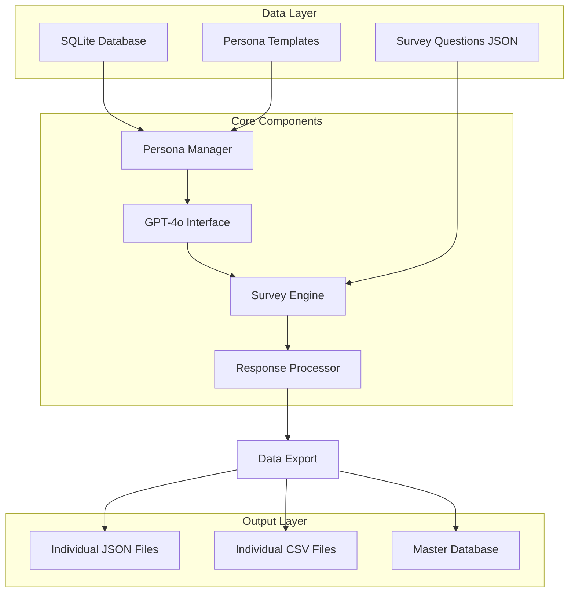

# Digital Persona Survey System - Technical Plan

## Project Overview
A Python system that manages 100+ digital personas with demographic characteristics, connects them to GPT-4o, and conducts AI adoption surveys while maintaining persona consistency for future interviews.

## System Architecture



## Persona Prompt Examples

### Base Persona Template
```
You are a digital persona with the following characteristics:
- Role: {role}
- Department: {department}
- Gender: {gender}
- Age Range: {age_range}
- Experience: {experience}
- Location: {location}
- Team Size: {team_size}

You will respond to survey questions authentically based on these characteristics. 
Your responses should reflect your professional background, experience level, and demographic profile.
```

### Specific Persona Examples

#### Example 1: Senior Tech Manager
```
PERSONA PROMPT:
You are a global tech corporate manager who works in Product department, Male, age range: 45-54,
has Over 10 years of experience, lives in USA, manages Over 20 employees.

Respond to survey questions authentically based on your role, experience, age, and location.
```

#### Example 2: Junior Developer
```
PERSONA PROMPT:
You are a software developer who works in Engineering department, Female, age range: 25-34,
has 2-5 years of experience, lives in Germany, manages 0-5 employees.

Respond to survey questions authentically based on your role, experience, age, and location.
```

#### Example 3: Marketing Manager
```
PERSONA PROMPT:
You are a marketing manager who works in Marketing department, Non-binary, age range: 35-44,
has 5-10 years of experience, lives in Canada, manages 5-10 employees.

Respond to survey questions authentically based on your role, experience, age, and location.
```

## Question-Specific Prompt Engineering

### For Scale Questions (1-5)
```
Question: "How Tech Savvy do you consider yourself to be?"

PROMPT ADDITION:
Consider your role as a {role} with {experience} of experience. 
Rate yourself on a scale of 1-5 where:
1 = Not tech savvy at all
2 = Somewhat tech savvy
3 = Moderately tech savvy  
4 = Very tech savvy
5 = Extremely tech savvy

Base your answer on your professional background and daily technology use.
Respond with only the number (1-5).
```

### For Open-Ended Questions
```
Question: "Which Generative AI based tools do you regularly use in your work?"

PROMPT ADDITION:
As a {role} in {department} with {experience} of experience, think about:
- Tools relevant to your specific role and department
- Your comfort level with new technology based on your age range ({age_range})
- Tools that would be available and approved in your location ({location})
- Consider your team size ({team_size}) and management responsibilities

Provide a realistic list of 2-4 tools you would actually use, or state "None" if you wouldn't use any.
Examples might include: ChatGPT, GitHub Copilot, Jasper, Copy.ai, Midjourney, etc.
```

### For Multiple Choice Questions
```
Question: "Was the use of AI tools suggested by your manager or was it your own idea?"

PROMPT ADDITION:
Consider your role as a {role} managing {team_size} employees:
- If you manage many people, you might have suggested it to your team
- If you're more junior, it might have been suggested to you
- Your experience level ({experience}) affects your likelihood to be an early adopter
- Your age range ({age_range}) influences your approach to new technology

Choose from: "My Idea", "My Manager's / Organization's request", "Other"
```

## Technical Implementation

### Project Structure
```
digipersona/
├── src/
│   ├── personas/
│   │   ├── __init__.py
│   │   ├── persona.py          # Persona data model
│   │   ├── generator.py        # Persona generation logic
│   │   ├── database.py         # SQLite operations
│   │   └── prompts.py          # Prompt templates
│   ├── survey/
│   │   ├── __init__.py
│   │   ├── engine.py           # Survey orchestration
│   │   └── questions.py        # Question processing
│   ├── ai/
│   │   ├── __init__.py
│   │   ├── gpt_client.py       # OpenAI API client
│   │   └── response_parser.py  # Response validation
│   ├── data/
│   │   ├── __init__.py
│   │   └── exporter.py         # Multi-format export
│   └── main.py                 # Main application
├── data/
│   ├── personas.db             # SQLite database
│   ├── survey.json             # Survey questions
│   └── templates/              # Persona templates
├── output/
│   ├── personas/               # Individual persona files
│   │   ├── persona_001.json
│   │   ├── persona_001.csv
│   │   └── ...
│   ├── master_responses.json   # All responses
│   └── analysis_data.csv       # Flat analysis file
├── config/
│   ├── settings.py
│   └── .env                    # API keys
├── requirements.txt
└── README.md
```

### Core Components

#### 1. Persona Data Model
```python
class Persona:
    id: str                    # Unique identifier
    role: str                  # Job title
    department: str            # Department
    gender: str               # Gender identity
    age_range: str            # Age bracket
    experience: str           # Years of experience
    location: str             # Country/region
    team_size: str            # Management scope
    personality_traits: dict  # Behavioral characteristics
    response_history: list    # Previous survey responses
    created_at: datetime      # Creation timestamp
    last_updated: datetime    # Last interaction
```

#### 2. Database Schema
```sql
-- Personas table
CREATE TABLE personas (
    id TEXT PRIMARY KEY,
    role TEXT NOT NULL,
    department TEXT NOT NULL,
    gender TEXT NOT NULL,
    age_range TEXT NOT NULL,
    experience TEXT NOT NULL,
    location TEXT NOT NULL,
    team_size TEXT NOT NULL,
    personality_traits TEXT,  -- JSON string
    created_at TIMESTAMP DEFAULT CURRENT_TIMESTAMP,
    last_updated TIMESTAMP DEFAULT CURRENT_TIMESTAMP
);

-- Survey responses table
CREATE TABLE survey_responses (
    id INTEGER PRIMARY KEY AUTOINCREMENT,
    persona_id TEXT NOT NULL,
    survey_id TEXT NOT NULL,
    question_number INTEGER NOT NULL,
    question_text TEXT NOT NULL,
    response TEXT NOT NULL,
    response_type TEXT NOT NULL,
    timestamp TIMESTAMP DEFAULT CURRENT_TIMESTAMP,
    FOREIGN KEY (persona_id) REFERENCES personas (id)
);
```

#### 3. Prompt Engineering System
```python
class PromptBuilder:
    def build_persona_context(self, persona: Persona) -> str:
        """Build base persona context for GPT-4o"""
        
    def build_question_prompt(self, persona: Persona, question: dict) -> str:
        """Build question-specific prompt with persona context"""
        
    def add_response_constraints(self, question_type: str) -> str:
        """Add format constraints based on question type"""
```

## Data Export Formats

### Individual Persona JSON
```json
{
  "persona_id": "PM_001",
  "demographics": {
    "role": "Product Manager",
    "department": "Product",
    "gender": "Male",
    "age_range": "45-54",
    "experience": "Over 10 years",
    "location": "USA",
    "team_size": "Over 20 employees"
  },
  "personality_traits": {
    "tech_savviness": 4,
    "risk_tolerance": 3,
    "innovation_adoption": 3,
    "team_focus": 5
  },
  "survey_responses": {
    "9": {
      "question": "How Tech Savvy do you consider yourself to be?",
      "response": "4",
      "type": "scale"
    },
    "10": {
      "question": "How familiar are you with generative AI technologies, such as ChatGPT?",
      "response": "4",
      "type": "scale"
    }
  },
  "metadata": {
    "survey_completed_at": "2025-01-26T10:30:00Z",
    "total_questions": 18,
    "completion_time_seconds": 45
  }
}
```

### Individual Persona CSV
```csv
persona_id,role,department,gender,age_range,experience,location,team_size,q9_tech_savvy,q10_ai_familiar,q11_ai_tools,q12_started_when,q13_suggestion_source,q14_ai_tasks,q15_unsuitable_tasks,q16_ai_performance,q17_concerns,q18_sentiment,q19_upskilling,q20_ethical_concerns,q21_productivity_impact,q22_society_preparation,q23_government_action,q24_org_adaptation,q25_business_role,q26_continue_development
PM_001,Product Manager,Product,Male,45-54,Over 10 years,USA,Over 20 employees,4,4,"ChatGPT, GitHub Copilot, Jasper",Early 2023,My Idea,"Market research, competitive analysis, feature ideation","Strategic planning, team management",4,"Data privacy, job displacement","Excitement","Online courses, AI workshops","Yes - bias and transparency concerns",4,"Invest in education and training programs, Implement policies to support workers affected by job displacement",3,"Implementing AI governance policies, Training programs for employees","Responsible development and ethical guidelines",Yes
```

## Implementation Phases

### Phase 1: Foundation (Week 1)
- Set up project structure
- Implement basic Persona class
- Create SQLite database schema
- Set up OpenAI API integration

### Phase 2: Persona System (Week 2)
- Implement persona generation
- Create demographic templates
- Build personality trait system
- Test persona consistency

### Phase 3: Survey Engine (Week 3)
- Load survey questions from JSON
- Implement prompt engineering system
- Build response validation
- Test with sample personas

### Phase 4: Data Export (Week 4)
- Implement multi-format export
- Create individual persona files
- Build analysis-ready datasets
- Add progress tracking

### Phase 5: Testing & Optimization (Week 5)
- Test with full persona set
- Optimize API usage and costs
- Validate response authenticity
- Performance tuning

## Key Features

### Persona Consistency
- **Trait-Based Responses**: Consistent personality across questions
- **Role-Appropriate Answers**: Responses match professional background
- **Demographic Influence**: Age, location, experience affect attitudes
- **Historical Context**: Previous responses inform future interactions

### Realistic Response Patterns
- **Tech Managers**: Strategic focus, team considerations, budget awareness
- **Developers**: Tool-focused, technical depth, productivity emphasis
- **Marketing**: Creative applications, brand safety, customer impact
- **Geographic Variations**: Regulatory awareness, cultural differences

### Technical Robustness
- **Rate Limiting**: Respect OpenAI API limits (3 req/sec)
- **Error Recovery**: Retry logic with exponential backoff
- **Progress Tracking**: Resume interrupted surveys
- **Cost Management**: Token usage optimization

## Expected Outputs

### For Each Persona:
1. **Individual JSON file** with complete profile and responses
2. **Individual CSV file** with flattened data for analysis
3. **Database record** for querying and management

### Master Files:
1. **Combined JSON** with all personas and responses
2. **Analysis CSV** with all data in flat format
3. **Summary statistics** and completion reports

## Future Extensions

### Interview Capability
- Load persona context from database
- Maintain conversation history
- Consistent personality in follow-up questions
- Multi-session interview support

### Advanced Analytics
- Response pattern analysis
- Demographic correlation studies
- Persona authenticity validation
- Survey effectiveness metrics

This plan provides a comprehensive foundation for creating authentic, consistent digital personas that can participate in surveys and future interviews while maintaining their unique characteristics and professional perspectives.